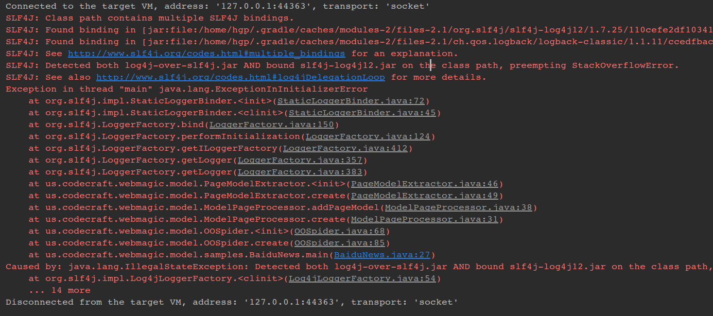
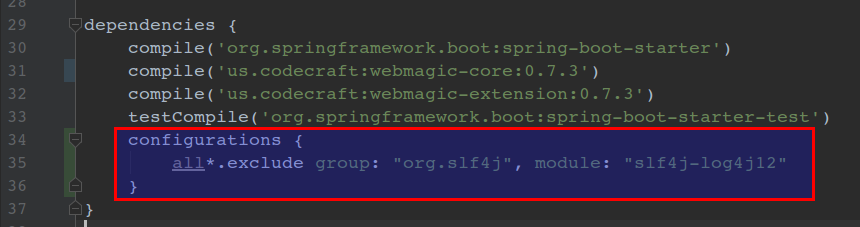
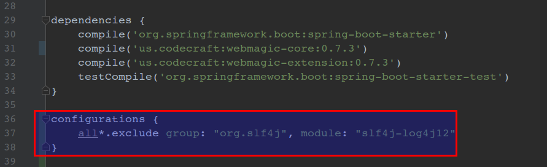

## SLF4J冲突问题

###### 冲突
```
SLF4J: Class path contains multiple SLF4J bindings.
SLF4J: Found binding in [jar:file:/home/hgp/.gradle/caches/modules-2/files-2.1/org.slf4j/slf4j-log4j12/1.7.25/110cefe2df103412849d72ef7a67e4e91e4266b4/slf4j-log4j12-1.7.25.jar!/org/slf4j/impl/StaticLoggerBinder.class]
SLF4J: Found binding in [jar:file:/home/hgp/.gradle/caches/modules-2/files-2.1/ch.qos.logback/logback-classic/1.1.11/ccedfbacef4a6515d2983e3f89ed753d5d4fb665/logback-classic-1.1.11.jar!/org/slf4j/impl/StaticLoggerBinder.class]
SLF4J: See http://www.slf4j.org/codes.html#multiple_bindings for an explanation.
SLF4J: Detected both log4j-over-slf4j.jar AND bound slf4j-log4j12.jar on the class path, preempting StackOverflowError. 
SLF4J: See also http://www.slf4j.org/codes.html#log4jDelegationLoop for more details.
Exception in thread "main" java.lang.ExceptionInInitializerError
	at org.slf4j.impl.StaticLoggerBinder.<init>(StaticLoggerBinder.java:72)
	at org.slf4j.impl.StaticLoggerBinder.<clinit>(StaticLoggerBinder.java:45)
	at org.slf4j.LoggerFactory.bind(LoggerFactory.java:150)
	at org.slf4j.LoggerFactory.performInitialization(LoggerFactory.java:124)
	at org.slf4j.LoggerFactory.getILoggerFactory(LoggerFactory.java:412)
	at org.slf4j.LoggerFactory.getLogger(LoggerFactory.java:357)
	at org.slf4j.LoggerFactory.getLogger(LoggerFactory.java:383)
	at us.codecraft.webmagic.model.PageModelExtractor.<init>(PageModelExtractor.java:46)
	at us.codecraft.webmagic.model.PageModelExtractor.create(PageModelExtractor.java:49)
	at us.codecraft.webmagic.model.ModelPageProcessor.addPageModel(ModelPageProcessor.java:38)
	at us.codecraft.webmagic.model.ModelPageProcessor.create(ModelPageProcessor.java:31)
	at us.codecraft.webmagic.model.OOSpider.<init>(OOSpider.java:68)
	at us.codecraft.webmagic.model.OOSpider.create(OOSpider.java:85)
	at us.codecraft.webmagic.model.samples.BaiduNews.main(BaiduNews.java:27)
Caused by: java.lang.IllegalStateException: Detected both log4j-over-slf4j.jar AND bound slf4j-log4j12.jar on the class path, preempting StackOverflowError. See also http://www.slf4j.org/codes.html#log4jDelegationLoop for more details.
	at org.slf4j.impl.Log4jLoggerFactory.<clinit>(Log4jLoggerFactory.java:54)
	... 14 more
Disconnected from the target VM, address: '127.0.0.1:44363', transport: 'socket'
```
###### gradle解决SLF4J冲突问题的终极方案一
```groovy
dependencies {
    compile('org.springframework.boot:spring-boot-starter')
    compile('us.codecraft:webmagic-core:0.7.3')
    compile('us.codecraft:webmagic-extension:0.7.3')
    testCompile('org.springframework.boot:spring-boot-starter-test')
    configurations {
        all*.exclude group: "org.slf4j", module: "slf4j-log4j12"
    }
}
```
###### gradle解决SLF4J冲突问题的终极方案二
```groovy
dependencies {
    compile('org.springframework.boot:spring-boot-starter')
    compile('us.codecraft:webmagic-core:0.7.3')
    compile('us.codecraft:webmagic-extension:0.7.3')
    testCompile('org.springframework.boot:spring-boot-starter-test')
}

configurations {
    all*.exclude group: "org.slf4j", module: "slf4j-log4j12"
}
```

###### 冲突

###### gradle解决SLF4J冲突问题的终极方案一

###### gradle解决SLF4J冲突问题的终极方案二

